# 💪 FitWithSubha — Smart Fitness & Health Tracking Platform

A modern fitness and calorie management web application designed to help users track body stats, calculate BMI/BMR, generate personalized fitness plans, monitor progress, and stay motivated throughout their transformation journey.

Built independently using HTML, CSS, and JavaScript with a responsive mobile-first design and interactive user experience.

---

## 🚀 Live Demo

🔗 https://iamdip-sk10.github.io/FitWithSubha/

---

## 📸 Project Preview

### Splash Screen
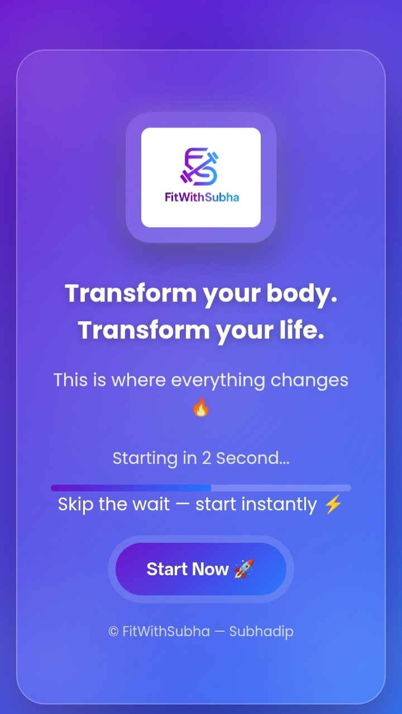

### Login Page
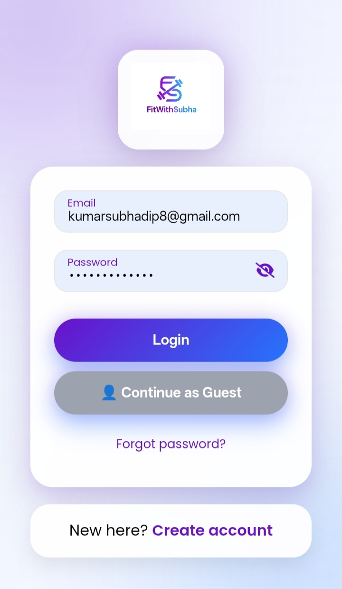

### Signup Page
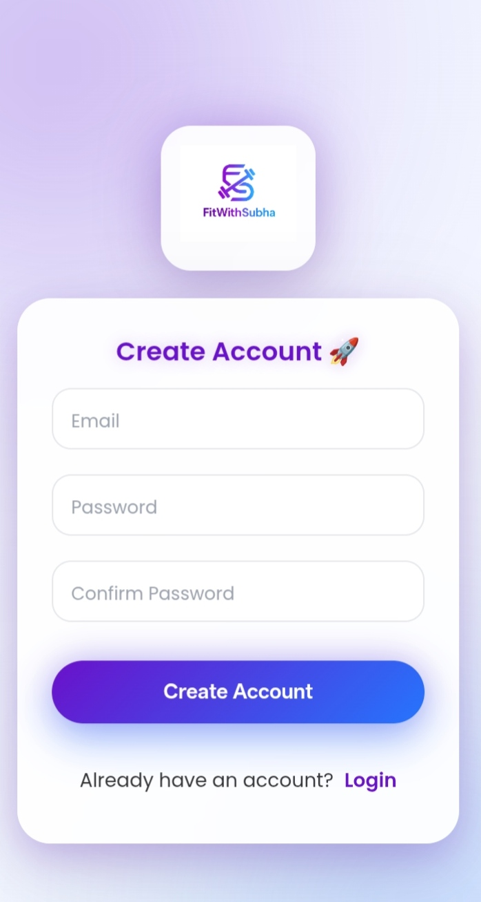

### Body Stats Calculator
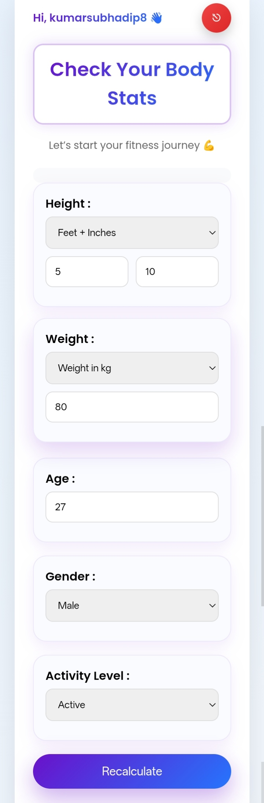

### BMI & Calorie Analysis
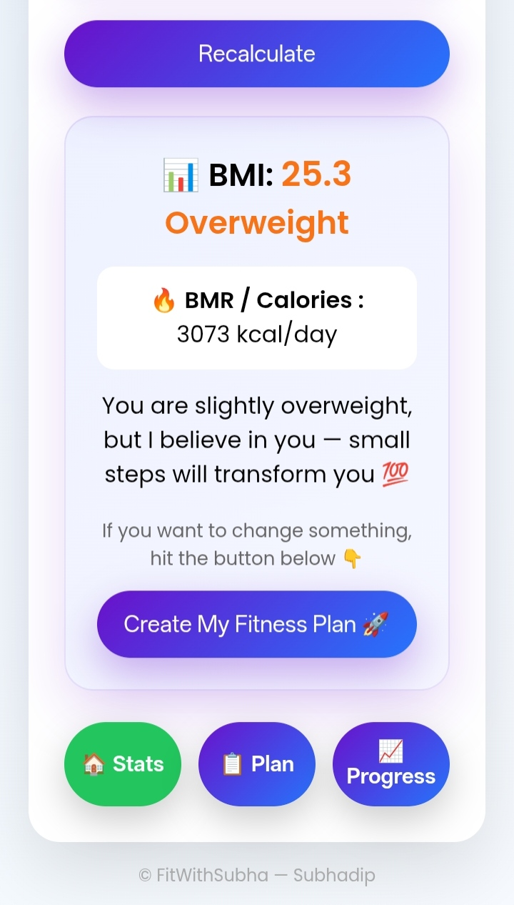

### Smart Fitness Plan
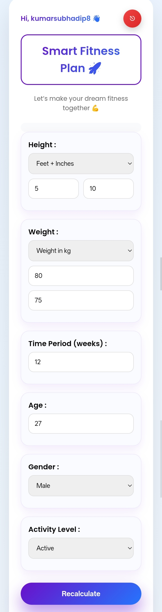

### AI-Style Recommendations
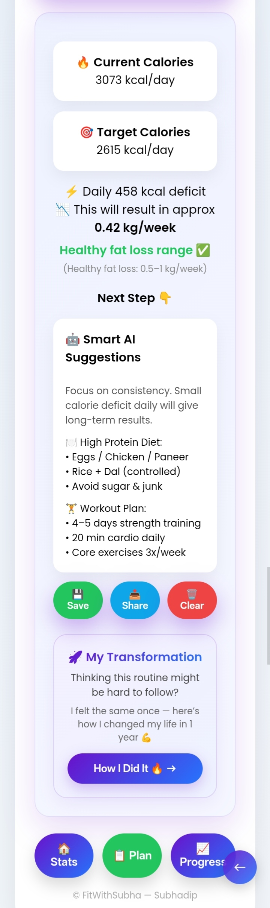

### Progress Tracker
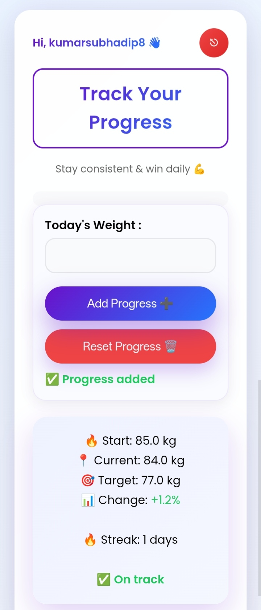

### Weight Progress Graph
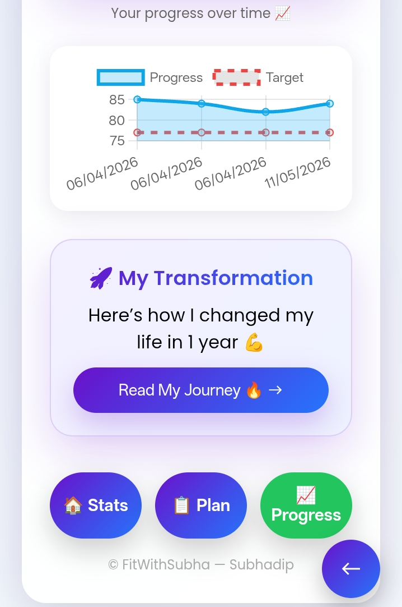

### Transformation Journey
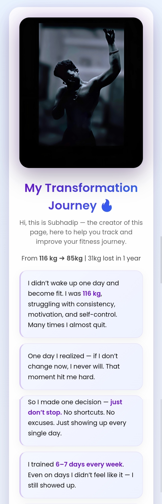

### Motivation & Guidance
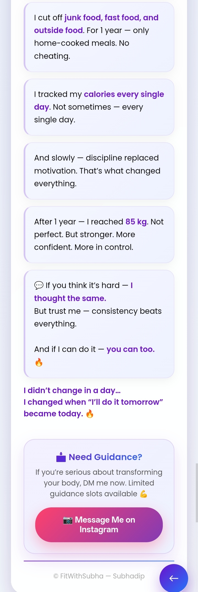

---

## ✨ Features

- 📊 BMI Calculator
- 🔥 BMR & Daily Calorie Calculator
- 🎯 Calorie Deficit Planning
- 🧠 Smart AI-Style Fitness Suggestions
- 📈 Progress Tracking System
- 📉 Weight Progress Graph
- 📱 Fully Responsive Mobile UI
- 🚀 Interactive Fitness Plan Generator
- 💪 Motivational Transformation Journey
- 💾 Save / Share / Reset Features

---

## 🛠️ Tech Stack

- HTML5
- CSS3
- JavaScript
- Responsive UI Design
- Local Storage

---

## 📌 Project Objective

The purpose of this project was to combine:
- fitness tracking
- calorie planning
- motivational guidance
- progress monitoring

into a single easy-to-use digital platform.

This project was inspired by my own real-life fitness transformation journey and 31 kg weight-loss transformation.

---

## 👨‍💻 Developed By

**Subhadip Kumar**  
Independent Personal Project

---

## 📬 Connect With Me

🔗 Portfolio: https://iamdip-sk10.github.io/subhadip-portfolio/  
🔗 GitHub: https://github.com/IamDip-SK10  

---

## ⭐ Note

This project was independently designed and developed as part of my portfolio to demonstrate:
- Frontend Development
- UI/UX Design
- Responsive Web Application Development
- Problem Solving
- Fitness Tech Innovation

---
